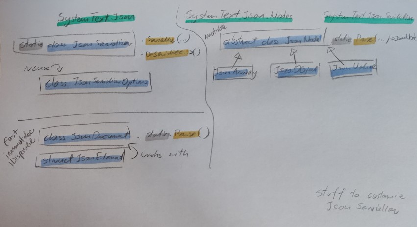

# Json

Should I use `System.Text.Json` (STJ) or `Newtonsoft.Json` (previously `Json.NET`)?

> use STJ, Newtonsoft is no longer enhanced with new features. The author works for Microsoft now on some non-json stuff.

[JamesNK reddit comment](https://www.reddit.com/r/dotnet/comments/14xgfjl/comment/jrocq6z/?utm_source=share&utm_medium=web3x&utm_name=web3xcss&utm_term=1&utm_content=share_button)

## Terms
*marshal* - assemble and arrange (a group of people, especially troops) in order.
> "the general marshalled his troops"

*marshalling* (UK) (in computer science) (marshal US) - getting parameters from here to there

*serialization* - transforming something (data) to a format usable for storage or transmission over the network

[https://stackoverflow.com/questions/770474/what-is-the-difference-between-serialization-and-marshaling](https://stackoverflow.com/questions/770474/what-is-the-difference-between-serialization-and-marshaling)

*JSON* - Java Script Object Notation - data interchange format.
[https://www.json.org/json-en.html](https://www.json.org/json-en.html)


## Why this post

While analysing some logs I used `FSharp.Data`'s `JsonProvider`. Only a few properties were relevant but `JsonProvider` stores the whole json in memory. With 10GB of logs to analyse I quick run out of memory.

Let's do some testing!

```F#
open System
open System.IO
open System.Text.Json

fsi.AddPrinter<DateTimeOffset>(fun dt -> dt.ToString("O"))

Environment.CurrentDirectory <- __SOURCE_DIRECTORY__ // ensures the script runs from the directory it's located in
// -------------------------------------------------------------------------

// sample log entry for testing
type LogEntry = {
    Timestamp : DateTimeOffset
    Level     : string
    Message   : string
}

// only the properties we're interested in
type LogEntryRecord = {
    Timestamp : DateTimeOffset
    Level     : string
}

let random = Random()
let levels = [ "INFO"; "WARN"; "ERROR"; "DEBUG" ]

let generateLogEntry () =
    {
        Timestamp = DateTimeOffset.Now.AddSeconds(-random.Next(0, 10000))
        Level     = levels.[random.Next(levels.Length)]
        Message   = String.replicate(random.Next(10, 100)) "x" // random string to simulate redundant content
    }

List.init 7_000_000 (fun _ -> generateLogEntry()) // 7M entries is around 1GB of data
|> List.map (fun entry -> JsonSerializer.Serialize(entry))
|> fun lines -> File.WriteAllLines("./logs.json", lines)

let lines = File.ReadAllLines "./logs.json"

let runWithMemoryCheck lines singleLineParser =
    GC.Collect()
    let before = GC.GetTotalMemory(true)
    let x = lines |> Array.map singleLineParser
    GC.Collect()
    let after = GC.GetTotalMemory(true)
    let m = ((after - before) |> float) / 1024. / 1024. / 1024. // GB
    x, m

#time
// -------------------------------------------------------------------------

open System.Text.Json.Nodes

#r "nuget: FSharp.Data"
open FSharp.Data

#r "nuget: FSharp.Json"
open FSharp.Json

type LogEntryJsonProvider = JsonProvider<"""
{
    "Timestamp"        : "2024-12-23T20:51:18.2020753+01:00",
    "Level"            : "ERROR",
    "Message"          : "File not found"
}""">

let fSharpDataJsonProvider = LogEntryJsonProvider.Parse

let fSharpDataJsonValue (x:string) =
    let line = x |> FSharp.Data.JsonValue.Parse
    let t = line.GetProperty("Timestamp").AsDateTimeOffset()
    let l = line.GetProperty("Level").AsString()
    { Timestamp = t; Level = l }

let stjJsonSerializer (x:string) = JsonSerializer.Deserialize<LogEntryRecord>(x)

let stjJsonNode (line:string) =
    let line = line |> JsonNode.Parse
    let t = line.["Timestamp"].GetValue<DateTimeOffset>()
    let l = line.["Level"].GetValue<string>()
    { Timestamp = t; Level = l }

let stjJsonDocument (x:string) =
    use doc = x |> JsonDocument.Parse
    let t = doc.RootElement.GetProperty("Timestamp").GetDateTimeOffset()
    let l = doc.RootElement.GetProperty("Level").GetString()
    { Timestamp = t; Level = l }

let sharpJson (x:string) = Json.deserialize<LogEntryRecord> x

runWithMemoryCheck lines fSharpDataJsonProvider |> snd |> printfn "Memory used: %f GB" // Memory used: 4.420363 GB | Real: 00:00:35.829, CPU: 00:02:07.312, GC gen0: 84,   gen1: 25,  gen2: 8
runWithMemoryCheck lines fSharpDataJsonValue    |> snd |> printfn "Memory used: %f GB" // Memory used: 0.521624 GB | Real: 00:00:16.557, CPU: 00:00:35.281, GC gen0: 29,   gen1: 10,  gen2: 4
runWithMemoryCheck lines stjJsonSerializer      |> snd |> printfn "Memory used: %f GB" // Memory used: 0.521555 GB | Real: 00:00:10.823, CPU: 00:00:44.453, GC gen0: 11,   gen1: 6,   gen2: 4
runWithMemoryCheck lines stjJsonNode            |> snd |> printfn "Memory used: %f GB" // Memory used: 0.521419 GB | Real: 00:00:09.533, CPU: 00:00:27.359, GC gen0: 16,   gen1: 7,   gen2: 4
runWithMemoryCheck lines stjJsonDocument        |> snd |> printfn "Memory used: %f GB" // Memory used: 0.521525 GB | Real: 00:00:06.208, CPU: 00:00:17.546, GC gen0: 5,    gen1: 4,   gen2: 4
runWithMemoryCheck lines sharpJson              |> snd |> printfn "Memory used: %f GB" // Memory used: 0.520846 GB | Real: 00:01:02.761, CPU: 00:01:20.578, GC gen0: 1022, gen1: 260, gen2: 4

```
### Conclusion

- `FSharp.Data.JsonProvider` is terrible compared to any other alternative (slow and uses lots more memory)
- `STJ.JsonDocument` is the speed winner.
- `FSharp.Json` supports F# types but it quite slow

## `System.Text.Json` cheat sheet




- JsonSerializer -> deserialize into fixed type
- JsonDocument   -> immutable (for reading only)
- JsonDocument   -> faster, IDisposable, uses shared memory pool
- JsonNode       -> mutable (you can construct json)

`JsonNode` vs `JsonDocument` see [https://learn.microsoft.com/en-us/dotnet/standard/serialization/system-text-json/use-dom#json-dom-choices](https://learn.microsoft.com/en-us/dotnet/standard/serialization/system-text-json/use-dom#json-dom-choices)

### `System.Text.Json.JsonSerializer`
```F#
open System
open System.Text.Json

// The System.Text.Json namespace contains all the entry points and the main types.
// The System.Text.Json.Serialization namespace contains attributes and APIs for advanced scenarios and customization specific to serialization and deserialization.

// System.Text.Json.JsonSerializer -> is a static class
//                                 -> you can instantiate and reuse the JsonSerialization options

let jsonString = """{
    "PropertyName1" : "dummyValue",
    "PropertyName2" : 42,
    "PropertyName3" : "2024-12-29T10:31:36.3774099+01:00",
    "PropertyName4" : {"NestedProperty" : 42},
    "PropertyName5" : [
        42,
        11
    ]
}"""

type InnerType = {
    NestedProperty: int
}

type DummyType = {
    PropertyName1: string
    PropertyName2: int
    PropertyName3: DateTimeOffset
    PropertyName4: InnerType
    PropertyName5: int list
}

type LogEntryRecord = {
    Timestamp: DateTimeOffset
    Level    : string
}


// # JsonSerializer.Deserialize

// JsonSerializer.Deserialize<'Type>(jsonString)
// JsonSerializer.Deserialize<'Type>(jsonString, options)
// JsonSerializer.DeserializeAsync(stream, ...) <- only streams can be parsed async cuz parsing string is purely CPU bound

// Deserialization behaviour:
//  - By default, property name matching is case-sensitive. You can specify case-insensitivity.
//  - Non-public constructors are ignored by the serializer.
//  - Deserialization to immutable objects or properties that don't have public set accessors is supported but not enabled by default.
//    ^ I'm not sure about this cuz F# records seem to work just fine

JsonSerializer.Deserialize<LogEntryRecord>(jsonString)
// { Timestamp = 0001-01-01T00:00:00.0000000+00:00 Level = null }
// no properties match but JsonSerializer just returns default values

JsonSerializer.Deserialize<DummyType>(jsonString)
// val it: DummyType = { PropertyName1 = "dummyValue"
//                       PropertyName2 = 42
//                       PropertyName3 = 2024-12-29T10:31:36.3774099+01:00
//                       PropertyName4 = { NestedProperty = 42 }
//                       PropertyName5 = [42; 11] }

// Deserialization is case sensitive by default!
let jsonString2 = """{
    "propertyName1" : "dummyValue",
    "propertyName2" : 42
}"""
JsonSerializer.Deserialize<DummyType>(jsonString2)
// val it: DummyType = { PropertyName1 = null
//                       PropertyName2 = 0
//                       PropertyName3 = 0001-01-01T00:00:00.0000000+00:00
//                       PropertyName4 = null
//                       PropertyName5 = null }
let options = new JsonSerializerOptions()
options.PropertyNameCaseInsensitive <- true
JsonSerializer.Deserialize<DummyType>(jsonString2, options)
// val it: DummyType = { PropertyName1 = "dummyValue"
//                       PropertyName2 = 42
//                       PropertyName3 = 0001-01-01T00:00:00.0000000+00:00
//                       PropertyName4 = null
//                       PropertyName5 = null }


// # JsonSerializer.Serialize

// let's pretty print during testing
// by default the json is minified
let options = new JsonSerializerOptions()
options.WriteIndented <- true

JsonSerializer.Serialize(options, options)
//val it: string =
//  "{
//  "Converters": [],
//  "TypeInfoResolver": {},
//  "TypeInfoResolverChain": [
//    {}
//  ],
//  "AllowOutOfOrderMetadataProperties": false,
//  "AllowTrailingCommas": false,
//  "DefaultBufferSize": 16384,
//  "Encoder": null,
//  "DictionaryKeyPolicy": null,
//  "IgnoreNullValues": false,
//  "DefaultIgnoreCondition": 0,
//  ...

// Serialization behaviour:
//  - by default, all public properties are serialized. You can specify properties to ignore. You can also include private members.
//  - by default, JSON is minified. You can pretty-print the JSON.
//  - by default, casing of JSON names matches the .NET names. You can customize JSON name casing.
//  - by default, fields are ignored. You can include fields.
```


### `System.Text.Json.JsonNode`
```F#
open System
open System.Text.Json.Nodes

let jsonString = """{
    "PropertyName1" : "dummyValue",
    "PropertyName2" : 42,
    "PropertyName3" : "2024-12-29T10:31:36.3774099+01:00",
    "PropertyName4" : {"NestedProperty" : 42},
    "PropertyName5" : [
        42,
        11
    ]
}"""

let x = JsonNode.Parse(jsonString) // type(x) = JsonNode
x.ToJsonString()
x.["PropertyName3"].GetValue<DateTimeOffset>()
x.["PropertyName3"].GetPath()
x.["PropertyName4"].["NestedProperty"].GetPath()
x.["PropertyName2"] |> int
// x.["PropertyName3"] |> DateTimeOffset // TODO - why can't I use this explicit conversion?

x["PropertyName4"].GetValueKind() |> string // "Object"
x["NonExistingProperty"] // null
x["NonExistingProperty"].GetValue<int>() // err - System.NullReferenceException
x["PropertyName5"].AsArray() |> Seq.map (fun a -> a.GetValue<int>()) // ok
x["PropertyName5"].AsArray() |> Seq.map int // ok
x["PropertyName5"].[0].GetValue<int>() // ok

// create a json object
let m = new JsonObject()
m["TimeStamp"] <- DateTimeOffset.Now
m.ToJsonString() // {"TimeStamp":"2024-12-29T16:06:17.046746+01:00"}
m["SampleProperty"] <- new JsonArray(1,2)
m.Remove("TimeStamp")

let a = JsonNode.Parse("""{"x":{"y":[1,2,3]}}""")
a.["x"] // this is a JasonNode
a.["x"].AsObject() // this returns a JsonObject
a.["x"].AsObject() |> Seq.map (fun x -> printfn "%A" x) // iterate over properties of the object
a.["x"].ToJsonString() // you can serialize subsection of the json
// {"y":[1,2,3]}

JsonNode.DeepEquals(x, a) // comparison
```

### `System.Text.Json.JsonDocument`
```F#
open System
open System.Text.Json

let jsonString = """{
    "PropertyName1" : "dummyValue",
    "PropertyName2" : 42,
    "PropertyName3" : "2024-12-29T10:31:36.3774099+01:00",
    "PropertyName4" : {"NestedProperty" : 42},
    "PropertyName5" : [
        42,
        11
    ]
}"""

use x = JsonDocument.Parse(jsonString) // remember this is an IDisposable
x.RootElement.GetProperty("PropertyName1").GetString()
x.RootElement.GetProperty("PropertyName2").GetInt32()
x.RootElement.GetProperty("PropertyName3").GetDateTime()
x.RootElement.GetProperty("PropertyName4").GetProperty("NestedProperty").GetInt32()
x.RootElement.GetProperty("PropertyName5").EnumerateArray() |> Seq.map (fun x -> x.GetInt32())

for i in x.RootElement.GetProperty("PropertyName5").EnumerateArray() do
    printfn "%A" i

// you could also write a generic helper

type JsonElement with
  member x.Get<'T>(name:string) : 'T =
    let p = x.GetProperty(name)
    match typeof<'T> with
    | t when t = typeof<string> -> p.GetString() |> unbox
    | t when t = typeof<int> -> p.GetInt32() |> unbox
    | t when t = typeof<DateTime> -> p.GetDateTime() |> unbox
    | t when t = typeof<JsonElement> -> p |> unbox
    | t when t = typeof<int[]> -> p.EnumerateArray() |> Seq.map (fun x -> x.GetInt32()) |> Seq.toArray |> unbox
    | _ -> failwith "unsupported type"

x.RootElement.Get<string>("PropertyName1")
```

## F# types and json serialization
```F#
open System.Text.Json

// Record - OK
type DummyRecord = {
    Text: string
    Num:  int
    }

let r = { Text = "asdf"; Num = 1 }

JsonSerializer.Serialize(r) |> JsonSerializer.Deserialize<DummyRecord>

let tuple = (42, "asdf")
JsonSerializer.Serialize(tuple) |> JsonSerializer.Deserialize<int * string>

type TupleAlias = int * string
let tuple2 = (43, "sfdg") : TupleAlias
JsonSerializer.Serialize(tuple2) |> JsonSerializer.Deserialize<TupleAlias>

// Discriminated Union :(
type SampleDiscriminatedUnion =
    | A of int
    | B of string
    | C of int * string
let x = A 1
JsonSerializer.Serialize(x) // eeeeeeeeeeeeee !

// Option - OK
JsonSerializer.Serialize(Some 42) |> JsonSerializer.Deserialize<int option>
JsonSerializer.Serialize(None) |> JsonSerializer.Deserialize<int option>
open System
type RecordTest2 = {
    Timestamp: DateTimeOffset
    Level: string
    TestOp: int option
    }

// Discriminated Union is supported in FSharp.Json
// https://github.com/fsprojects/FSharp.Json
#r "nuget: FSharp.Json"
open FSharp.Json
let data = C (42, "The string")
let json = Json.serialize data
// val json: string = "{
//   "C": [
//     42,
//     "The string"
//   ]
// }

let deserialized = Json.deserialize<SampleDiscriminatedUnion> json
// val deserialized: SampleDiscriminatedUnion = C (42, "The string")
```

## More on `FSharp.Data`'s `JsonValue`
```F#
#r "nuget:FSharp.Data"
open FSharp.Data

let j = JsonValue.Parse("""{"x":{"y":[1,2,3]}}""")
j.Properties()
// val it: (string * JsonValue) array =
//   [|("x", {
//   "y": [
//     1,
//     2,
//     3
//   ]
// })|]
j.["x"].["y"].AsArray()
j.TryGetProperty "x"

// JsonValue is a discriminated union
// union JsonValue =
//   | String  of string
//   | Number  of decimal
//   | Float   of float
//   | Record  of properties: (string * JsonValue) array
//   | Array   of elements: JsonValue array
//   | Boolean of bool
//   | Null
//
// docs:
// https://fsprojects.github.io/FSharp.Data/reference/fsharp-data-jsonvalue.html
// https://fsprojects.github.io/FSharp.Data/library/JsonValue.html <- if you'll be working with JsonValue read this
//
// there are also extension methods:
// https://fsprojects.github.io/FSharp.Data/reference/fsharp-data-jsonextensions.html
//
// AsArray doesn't fail if the value is not an array, as opposed to other AsSth methods
// See below how extension methods are defined
// source: https://github.com/fsprojects/FSharp.Data/blob/main/src/FSharp.Data.Json.Core/JsonExtensions.fs
open System.Globalization
open System.Runtime.CompilerServices
open System.Runtime.InteropServices
open FSharp.Data.Runtime
open FSharp.Core

[<Extension>]
type JsonExtensions =
    /// Get all the elements of a JSON value.
    /// Returns an empty array if the value is not a JSON array.
    [<Extension>]
    static member AsArray(x: JsonValue) =
        match x with
        | (JsonValue.Array elements) -> elements
        | _ -> [||]

    /// Get a number as an integer (assuming that the value fits in integer)
    [<Extension>]
    static member AsInteger(x, [<Optional>] ?cultureInfo) =
        let cultureInfo = defaultArg cultureInfo CultureInfo.InvariantCulture

        match JsonConversions.AsInteger cultureInfo x with
        | Some i -> i
        | _ ->
            failwithf "Not an int: %s"
            <| x.ToString(JsonSaveOptions.DisableFormatting)

// construct a json object
let d =
    JsonValue.Record [|
        "event",      JsonValue.String "asdf"
        "properties", JsonValue.Record [|
            "token",       JsonValue.String "tokenId"
            "distinct_id", JsonValue.String "123123"
        |]
    |]

d.ToString().Replace("\r\n", "").Replace(" ", "")

// if you want to process the json object
for (k, v) in d.Properties() do
    printfn "Property: %s" k
    match v with
    | JsonValue.Record props -> printfn "\t%A" props
    | JsonValue.String s     -> printfn "\t%A" s
    | JsonValue.Number n     -> printfn "\t%A" n
    | JsonValue.Float f      -> printfn "\t%A" f
    | JsonValue.Array a      -> printfn "\t%A" a
    | JsonValue.Boolean b    -> printfn "\t%A" b
    | JsonValue.Null         -> printfn "\tnull"
```

## Serialize straight to UTF-8
`JsonSerializer.SerializeToUtf8Bytes(value, options)` <- why does this one exist?
> Strings in .Net are stored in memory as UTF-16, so if you don't need a string, you can use this method and serialize straight to UTF-8 bytes (it's 5-10% faster, see link)
[https://learn.microsoft.com/en-us/dotnet/standard/serialization/system-text-json/how-to#serialize-to-utf-8](https://learn.microsoft.com/en-us/dotnet/standard/serialization/system-text-json/how-to#serialize-to-utf-8)

## More links
[https://stu.dev/a-look-at-jsondocument/](https://stu.dev/a-look-at-jsondocument/)

[https://blog.ploeh.dk/2023/12/18/serializing-restaurant-tables-in-f/](https://blog.ploeh.dk/2023/12/18/serializing-restaurant-tables-in-f/)

[https://devblogs.microsoft.com/dotnet/try-the-new-system-text-json-apis/?ref=stu.dev](https://devblogs.microsoft.com/dotnet/try-the-new-system-text-json-apis/?ref=stu.dev) - a post from when they introduced the new json API

TODO for myself - watch these maybe

 - [https://www.youtube.com/watch?v=TjVcVWB0oFk&list=PLEzQf147-uEoNCeDlRrXv6ClsLDN-HtNm&index=1](https://www.youtube.com/watch?v=TjVcVWB0oFk&list=PLEzQf147-uEoNCeDlRrXv6ClsLDN-HtNm&index=1)
 - [https://www.infoq.com/presentations/Heretical-Open-Source/](https://www.infoq.com/presentations/Heretical-Open-Source/)
